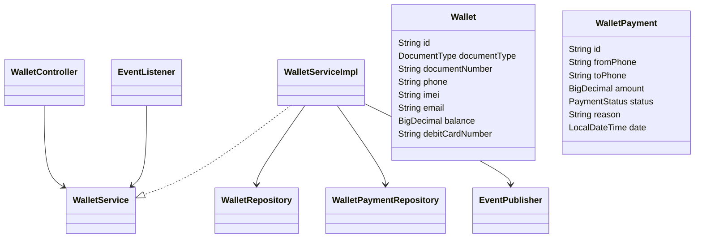
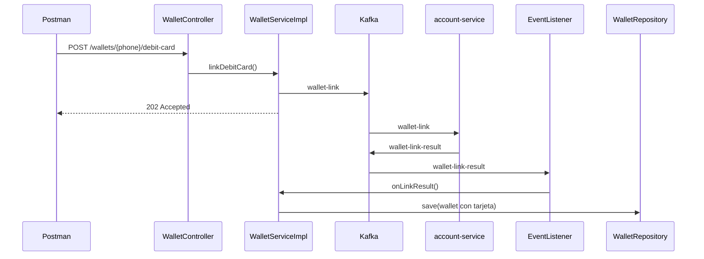
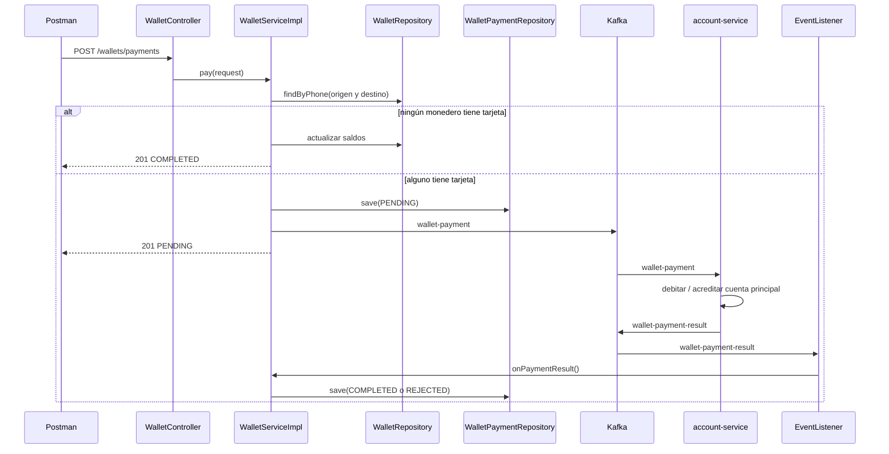

# Diagramas

## Clases

```mermaid
classDiagram
  WalletController --> WalletService
  WalletServiceImpl ..|> WalletService
  WalletServiceImpl --> WalletRepository
  WalletServiceImpl --> WalletPaymentRepository
  WalletServiceImpl --> EventPublisher
  EventListener --> WalletService
  class Wallet {
    String id
    DocumentType documentType
    String documentNumber
    String phone
    String imei
    String email
    BigDecimal balance
    String debitCardNumber
  }
  class WalletPayment {
    String id
    String fromPhone
    String toPhone
    BigDecimal amount
    PaymentStatus status
    String reason
    LocalDateTime date
  }
```

## Secuencia: asociar tarjeta de débito

```mermaid
sequenceDiagram
  Postman->>WalletController: POST /wallets/{phone}/debit-card
  WalletController->>WalletServiceImpl: linkDebitCard()
  WalletServiceImpl->>Kafka: wallet-link
  WalletServiceImpl-->>Postman: 202 Accepted
  Kafka->>account-service: wallet-link
  account-service->>Kafka: wallet-link-result
  Kafka->>EventListener: wallet-link-result
  EventListener->>WalletServiceImpl: onLinkResult()
  WalletServiceImpl->>WalletRepository: save(wallet con tarjeta)
```

## Secuencia: pago por número de celular

```mermaid
sequenceDiagram
  Postman->>WalletController: POST /wallets/payments
  WalletController->>WalletServiceImpl: pay(request)
  WalletServiceImpl->>WalletRepository: findByPhone(origen y destino)
  alt ningún monedero tiene tarjeta
    WalletServiceImpl->>WalletRepository: actualizar saldos
    WalletServiceImpl-->>Postman: 201 COMPLETED
  else alguno tiene tarjeta
    WalletServiceImpl->>WalletPaymentRepository: save(PENDING)
    WalletServiceImpl->>Kafka: wallet-payment
    WalletServiceImpl-->>Postman: 201 PENDING
    Kafka->>account-service: wallet-payment
    account-service->>account-service: debitar / acreditar cuenta principal
    account-service->>Kafka: wallet-payment-result
    Kafka->>EventListener: wallet-payment-result
    EventListener->>WalletServiceImpl: onPaymentResult()
    WalletServiceImpl->>WalletPaymentRepository: save(COMPLETED o REJECTED)
  end
```
